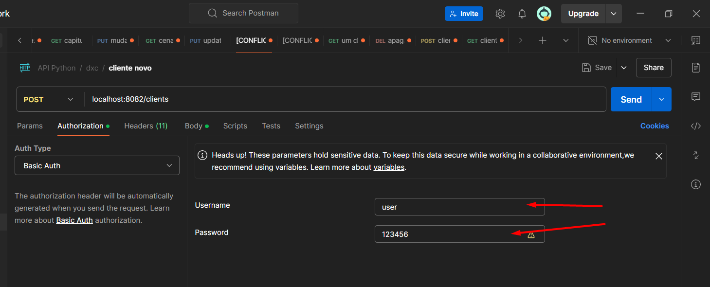

# Descrição
Este sistema se propõe à criação de um projeto de microsserviço para manipulação do banco de dados de clientes podendo serem feitas consultas, exclusões, criações e alterações de clientes (CRUD)
A inclusão de clientes valida campos nulos e vazios, além de validar CPF e e-mail.
Desenvolvido em Java 11, com Spring Boot versão 2.7.18 compatível com a versão do Java elencada. Banco H2.

# Estrutura

1. Model: Classes de modelo dos objetos de Cliente.
2. Repository: Interface responsável pela operações com o banco de dados que abstrai implementações JPA.
3. Service: Implementação da interface Repository responsável pela lógica de negócios da aplicação. Realiza validações, manipula dados é usada no Controller.
4. Controller: Implementação dos endpoints da API RESTful que permitem que os clientes interajam com o sistema.
5. Config: Configuração de autenticação do spring security para permitir testes com postman

# Teste
* Queries Nativas: Query nativa para consulta de clientes por email.
* Exceções Personalizadas: Exceção Personalizada para as classes Controller apenas como demonstração de customização de mensagens de estouro de exceções.
* Spring Security: Authenticação com Spring Secutiry usando configuração simplificada para testes com user e password cadastrados no application.properties para facilitar testes com a ferramenta postman usando Basic Auth
* Spring Test: Para testes de integração com o Spring Boot contendo em sua biblioteca JUnit, Mockito, entre outras.

# Postman

Os testes no postman foram executados utilizando senha e usuários cadastrados no application.properties:
```
spring.security.user.name=user
spring.security.user.password=123456
```


Testes prontos:
Post -> localhost:8082/clients 
Porta alterada para não interferir em outros projetos
```
{
  "firstName": "Jhon",
  "lastName" : "Do",
  "birthDate" : "10-02-1999",
  "email": "jhonny@mail.com",
  "cpf": "739.482.357-16"
}
```